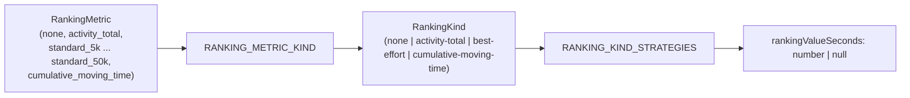

# Cumulative Ranking Times (Ranking Kind Refactor)

## Overview

Introduce a `RankingKind` abstraction between `RankingMetric` and the ranking strategy functions in `$lib/server/strava/challenge-ranking.ts`. Add a new `CUMULATIVE_MOVING_TIME` metric so cumulative challenges can rank finishers by total moving time across contributions, not only by a single best-effort split. Add an admin-side compatibility matrix so metrics that don't make sense for a given challenge type can't be chosen.

## Why This Matters

Today `computeRankingValueFromContributions` branches on `RankingMetric` inline, and every standard-distance metric (400m through 50k) relies on the same best-effort math. This has two practical problems:

1. **Adding new ranking semantics requires editing the dispatcher.** A cumulative-time ranking can't be expressed without widening the core function.
2. **Cumulative challenges with distance-based metrics create UX cliffs.** Example: goal = half marathon, `ranking_metric = standard_half_marathon`. A runner who splits the distance across two runs completes the goal (sum of distances) but gets `rankingValueSeconds = null` because neither individual contribution contains a half-marathon best effort. They appear on the leaderboard as "completed but unranked" while a runner who did it in one go gets ranked.

The factory pattern already used for `CHALLENGE_VALIDATORS` and `CHALLENGE_PARTICIPANT_STATE_STRATEGIES` is a natural fit: group metrics by their ranking "kind" (none, activity-total, best-effort, cumulative-time), register one strategy per kind, and drive admin UX from the same constants.

## Design

### RankingKind abstraction

```ts
// $lib/constants/challenge.ts
export const RANKING_KIND = {
	NONE: 'none',
	ACTIVITY_TOTAL: 'activity-total',
	BEST_EFFORT: 'best-effort',
	CUMULATIVE_MOVING_TIME: 'cumulative-moving-time'
} as const;
export type RankingKind = (typeof RANKING_KIND)[keyof typeof RANKING_KIND];

export const RANKING_METRIC_KIND: Record<RankingMetric, RankingKind> = {
	[RANKING_METRIC.NONE]: RANKING_KIND.NONE,
	[RANKING_METRIC.ACTIVITY_TOTAL]: RANKING_KIND.ACTIVITY_TOTAL,
	[RANKING_METRIC.CUMULATIVE_MOVING_TIME]: RANKING_KIND.CUMULATIVE_MOVING_TIME,
	[RANKING_METRIC.STANDARD_400M]: RANKING_KIND.BEST_EFFORT,
	// ... through STANDARD_50K all map to BEST_EFFORT
	[RANKING_METRIC.STANDARD_50K]: RANKING_KIND.BEST_EFFORT
};
```

Adding a new standard distance becomes a one-line addition to `RANKING_METRIC_VALUES`, `RANKING_METRIC_DISTANCES`, and `RANKING_METRIC_KIND`. No new strategy function.

### Strategy registry

```ts
// $lib/server/strava/challenge-ranking.ts
type RankingStrategy = (
	contributions: ChallengeContribution[],
	metric: RankingMetric
) => number | null;

function rankByNone(): number | null {
	return null;
}

function rankByFastestActivity(contributions: ChallengeContribution[]): number | null {
	let bestTime: number | null = null;
	for (const c of contributions) {
		const time = getPreferredTime(c.movingTime, c.elapsedTime);
		if (time == null) continue;
		if (bestTime == null || time < bestTime) bestTime = time;
	}
	return bestTime;
}

function rankByBestEffortAtMetric(
	contributions: ChallengeContribution[],
	metric: RankingMetric
): number | null {
	let bestTime: number | null = null;
	for (const c of contributions) {
		const time = extractRankingValueFromBestEfforts(c.bestEfforts, metric);
		if (time == null) continue;
		if (bestTime == null || time < bestTime) bestTime = time;
	}
	return bestTime;
}

function rankByCumulativeMovingTime(contributions: ChallengeContribution[]): number | null {
	if (contributions.length === 0) return null;
	const total = sumMovingTimes(contributions);
	return total > 0 ? total : null;
}

const RANKING_KIND_STRATEGIES = {
	[RANKING_KIND.NONE]: rankByNone,
	[RANKING_KIND.ACTIVITY_TOTAL]: rankByFastestActivity,
	[RANKING_KIND.BEST_EFFORT]: rankByBestEffortAtMetric,
	[RANKING_KIND.CUMULATIVE_MOVING_TIME]: rankByCumulativeMovingTime
} satisfies Record<RankingKind, RankingStrategy>;

export function computeRankingValueFromContributions(
	contributions: ChallengeContribution[],
	metric: RankingMetric
): number | null {
	const kind = RANKING_METRIC_KIND[metric];
	return RANKING_KIND_STRATEGIES[kind](contributions, metric);
}
```

The public signature of `computeRankingValueFromContributions` is preserved. `participant-state.ts` needs no changes. `extractRankingValueFromBestEfforts` remains the only place that applies the 1% distance tolerance and moving/elapsed-time fallback.

### Compatibility matrix (admin guardrails)

```ts
// $lib/constants/challenge.ts
export const CHALLENGE_TYPE_ALLOWED_RANKING_KINDS = {
	[CHALLENGE_TYPE.BEST_EFFORT]: [
		RANKING_KIND.NONE,
		RANKING_KIND.ACTIVITY_TOTAL,
		RANKING_KIND.BEST_EFFORT
	],
	[CHALLENGE_TYPE.CUMULATIVE]: [
		RANKING_KIND.NONE,
		RANKING_KIND.ACTIVITY_TOTAL,
		RANKING_KIND.BEST_EFFORT,
		RANKING_KIND.CUMULATIVE_MOVING_TIME
	],
	[CHALLENGE_TYPE.SEGMENT_RACE]: [RANKING_KIND.NONE]
} satisfies Record<ChallengeType, RankingKind[]>;

export function isRankingMetricAllowedForChallengeType(
	challengeType: ChallengeType,
	metric: RankingMetric
): boolean {
	const kind = RANKING_METRIC_KIND[metric];
	return CHALLENGE_TYPE_ALLOWED_RANKING_KINDS[challengeType].includes(kind);
}
```

Optional stricter rule for cumulative: reject distance-based metrics whose target distance is >= the challenge goal distance, since they can only ever be earned in a single run.

```ts
export function isRankingMetricCompatibleWithGoal(
	challengeType: ChallengeType,
	metric: RankingMetric,
	goalDistance: number | null
): boolean {
	if (challengeType !== CHALLENGE_TYPE.CUMULATIVE) return true;
	const targetMeters = RANKING_METRIC_DISTANCES[metric];
	if (targetMeters == null) return true;
	if (goalDistance == null) return true;
	return targetMeters < goalDistance;
}
```

## Flow



## File Plan

- **Update:** `src/lib/constants/challenge.ts`
	- Add `cumulative_moving_time` to `RANKING_METRIC_VALUES` / `RANKING_METRIC`
	- `RANKING_METRIC_DISTANCES[CUMULATIVE_MOVING_TIME] = null`
	- Add `RANKING_KIND`, `RankingKind`, `RANKING_METRIC_KIND`
	- Add `CHALLENGE_TYPE_ALLOWED_RANKING_KINDS`
	- Add `isRankingMetricAllowedForChallengeType`, `isRankingMetricCompatibleWithGoal`
- **Update:** `src/lib/server/strava/challenge-ranking.ts`
	- Add `RANKING_KIND_STRATEGIES` registry
	- Replace inline branching in `computeRankingValueFromContributions` with kind dispatch
	- Add `rankByCumulativeMovingTime` strategy
- **Update:** `src/lib/db/schema.ts`
	- Add `cumulative_moving_time` to the `challenge_ranking_metric` pg enum (Drizzle migration)
- **Update:** `src/routes/(app)/admin/_components/challenges/ChallengeForm.svelte`
	- Filter `rankingMetricOptions` by `isRankingMetricAllowedForChallengeType(challengeType, ...)`
	- Optionally apply `isRankingMetricCompatibleWithGoal`
	- Reset `rankingMetric` when `challengeType` changes and the current choice is disallowed
- **Update:** `src/routes/(app)/admin/_components/challenges/ChallengeCard.svelte`
	- Same filtering on edit options
- **Update:** `src/routes/(app)/admin/+page.server.ts`
	- Reject create/update actions whose metric isn't allowed for the chosen type (and optionally goal)
- **Update:** `src/lib/utils/challenge.ts` (`formatResultDisplay`)
	- Should already work; seconds remain the underlying unit
- **Update:** `docs/challenge-ranking-metric-plan.md`
	- Document the `RankingKind` layer and the allowed-kinds matrix

## Migration

```sql
ALTER TYPE challenge_ranking_metric ADD VALUE 'cumulative_moving_time';
```

No backfill required. Existing participants keep their current `ranking_value_seconds`. New value becomes selectable in admin once the app code ships.

## Testing Checklist

- Unit tests for `computeRankingValueFromContributions`:
	- `NONE` returns null regardless of contributions
	- `ACTIVITY_TOTAL` picks fastest single activity's preferred time
	- Standard distance returns min across contributions with 1% tolerance
	- `CUMULATIVE_MOVING_TIME` sums all moving times; empty list returns null; zero/negative sum returns null
- Unit tests for `isRankingMetricAllowedForChallengeType`:
	- CUMULATIVE + CUMULATIVE_MOVING_TIME allowed
	- BEST_EFFORT + CUMULATIVE_MOVING_TIME rejected
	- SEGMENT_RACE allows only NONE
- Unit tests for `isRankingMetricCompatibleWithGoal`:
	- CUMULATIVE + STANDARD_HALF_MARATHON + goal=21097 rejected
	- CUMULATIVE + STANDARD_5K + goal=21097 allowed
	- BEST_EFFORT path always true
- Integration test: webhook CREATE on a cumulative challenge with `CUMULATIVE_MOVING_TIME` populates `rankingValueSeconds` as sum of contribution moving times.
- Admin form test: switching challenge type resets a now-disallowed ranking metric.

## Notes / Open Questions

- **Highlight activity for cumulative-time ranking:** existing cumulative strategy sets `highlightActivityId` to the currently processed activity. That remains a sensible default; no change needed. If we later want a kind-driven highlight picker, introduce a parallel `HIGHLIGHT_STRATEGIES` registry keyed on `RankingKind`.
- **Null-vs-zero semantics for cumulative time:** treat contributions with `movingTime = null` as 0 in the sum (current `sumMovingTimes` behavior). Return `null` only when there are no contributions at all or the sum is non-positive, so unranked participants stay sorted at the end of the leaderboard.
- **Future kinds (elevation gain, average pace, etc.):** should slot in as additional rows in `RANKING_KIND`, `RANKING_METRIC_KIND`, and `RANKING_KIND_STRATEGIES` with no changes to the public API.
